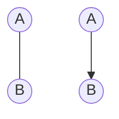
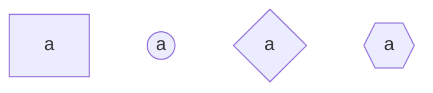
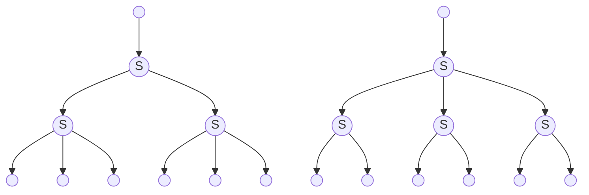

<h1 align="center">Формульный и алгоритмический анализ методов взаимодействия пользователя с конвейерными лентами и маршрутизаторами в компьютерных моделях</h1>

<br>

## Оглавление:
0. [Введение](##Оглавление)
1. Терминология
    1. [Конвейер](#конвейер)
    2. [Конвейерный разъединитель](#Конвейерный-соединитель)
    3. [Конвейерный соединитель](#Конвейерный-разъединитель)
    4. [Типология]
        1. [Быстрые системы](#быстрые-системы)
2. [Вычисление разделителей]
3. [Отрисовка графа]

<br><br>

<span style="padding-left: 20px">
В данной работе рассматривается типизация, реализация и взаимодействие друг с другом таких объектов, как: конвейерная лента, конвейерный соеденитель, конвейерный разъединитель, и прочие их надстройки
</span>

<span style="padding-left: 20px">

</span>

<br><br>


# Конвейер
<span style="padding-left: 20px">
Конвейер &mdash; средство непрерывной перевозки ресурсов между двумя любыми точками.
</span>
<br><br>

Каждый конвейер характеризуется:
+ Формой 
    + Описывается системой уравнений: &nbsp; $\vec{r}(t) = \begin{cases} x_1 = x_1(t) \\ \vdots \\ x_n = x_n(t) \\ \end{cases} \subset \ \mathbb{R}^n$

    + В частности: $\mathbb{R}^3$ (Satisfactory) или $\mathbb{R}^2$ (Factoro)

+ Функцией распределения динамики скорости вдоль конвейера $v(\vec{r}, t) \cong v(t_{\text{path}}, t_{\text{time}}) = v\left(\vec{t}\right)$

+ Начальной и конечной точкой: $A = \vec{r}(0), \ B = \vec{r}(t\to\text{max})$

<br>

<span style="padding-left: 20px">
На чертежах обозначается кривой, либо отрезком, соединяющим точки A и B. Может иметь стрелки для указания направления движения.
</span>

<br>





<br><br><br>

# Конвейерный соединитель
<span style="padding-left: 20px">
Конвейерный соединитель &mdash; устройство, соединяющее несколько входных лент в одну. Ресурсы выводятся по заданным правилам, и выбор между ресурсами производится по другим правилам
</span>

<br>

Каждый конвейерный соединитель характеризуется:
+ числом входных лент $n$
+ правилами распределения: $\{ \varphi_i(v_{\text{in}}) \ | \ i \in \mathbb{N} , i \le n \}$
+ правилом вывода: $\psi$

<br>

<span style="padding-left: 20px">
На чертежах обозначается n-угольником (обычно, квадрат) с буквой "a" (adder), к которому с одной стороны подводится конвейер на вывод, а с остальных сторон &mdash; конвейеры входят
</span>

<br>





<br><br><br>

# Конвейерный разъединитель
<span style="padding-left: 20px">
Конвейерный разъединитель &mdash; устройство, разъединяющее одну конвейерную ленту на несколько других, пропускающих ресурсы по заданным правилам
</span>

<br>

Каждый конвейерный разъединитель характеризуется:
+ числом выходных лент $n$
+ правилами распределения: $\{ \varphi_i(v_{\text{in}}) \ | \ i \in \mathbb{N} , i \le n \}$

<br>

<span style="padding-left: 20px">
На чертежах обозначается n-угольником (обычно, квадрат) с буквой "s" (splitter), к которому с одной стороны подводится конвейер, а с остальных сторон &mdash; конвейеры отводятся
</span>

<br>


<br><br>


<h1 align="center">Какими бывают системы данных элементов?</h1>
<br><br><br>

# быстрые системы

Рассмотрим следующую систему:
+ Конвейер имеет равномерную скорость $v$ (достаточно большое)
+ Есть несколько видов конвейерных разъединителей.
    + число выходов которых образует множество $\{ t_1, ..., t_n \}$
    + правило вывода: чередовать ресурс между выходами
        + схема очерёдности вывода для делителя на 4:
        ```mermaid
        graph TD;
            1((1))
            2((2))
            3((3))
            4((4))

            1---2;
            2---3;
            1---4;
            4---3;
        ```
        + распределение происходит мгновенно, как только ресурс заходит &mdash; так только и выходит
+ Конвейерный соединитель может принимать любое число ресурсов, и мгновенно объединяет их в один конвейер

Назовём такую систему "быстрой"

<br>

В быстрых системах определён следующий набор действий:
+ Разделение &mdash; разделение одного конвейера на $T = \{t_i\}$ равных частей,
+ Соединение &mdash; соединение $n \in \mathbb{N}$ конвейеров в один,
+ Отделение &mdash; набор из последовательных и параллельныхсоединений с целью отделения $q_1$ ресурсов от конвейерной ленты, перевозящей $q_0$ ресурсов ($q_1 < q_0$)
+ Возврат &mdash; сначала отделение некоторой части потока, а затем соединение этой части с началом самого потока
    + Пример:
        ```mermaid
        graph LR;
            1((1))
            2((2))
            3((3))
            4((4))
            5((5))
            6((6))

            1-->2
            2-->3
            3-->6
            3-->4
            4-->2
            4-->5
        ```

<br><br>

<span style="padding-left: 20px">Назовём </span>
все числа вида $\prod_{i=1}^n t_i^{a_i}$ , где $a_i \in \mathbb{N}_0$ "стандартными". Тогда каждое число, обратное стандартному может быть полученно, как отделение от конвейера в 1 при помощи смеси $t_1$-арного, ..., и $t_n$-арного деревьев

Пример: для множества $T = \{2, 3\}$ , число $2^13^1=6$ является стандартным, тогда $1/6$ является стандартной дробью, его можно получить двумя способами:


<br><br>

## Теорема о делимости:


