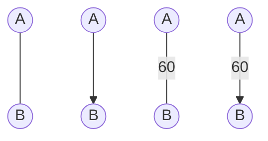
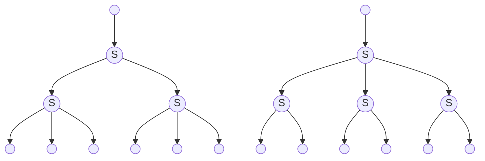
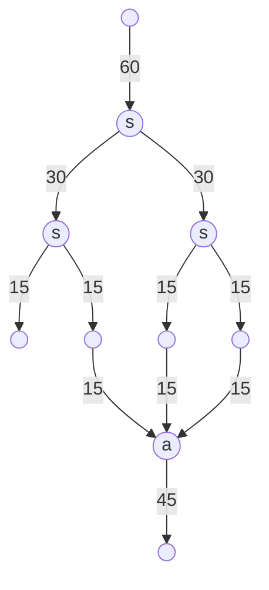
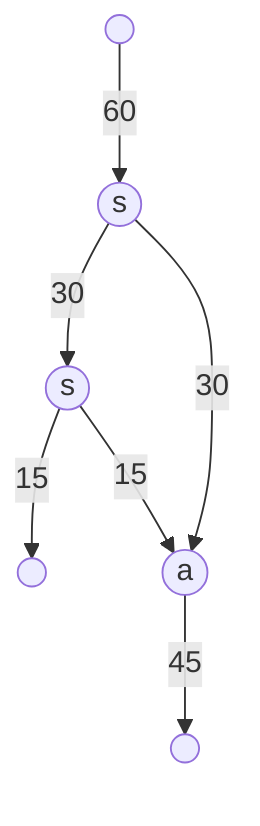
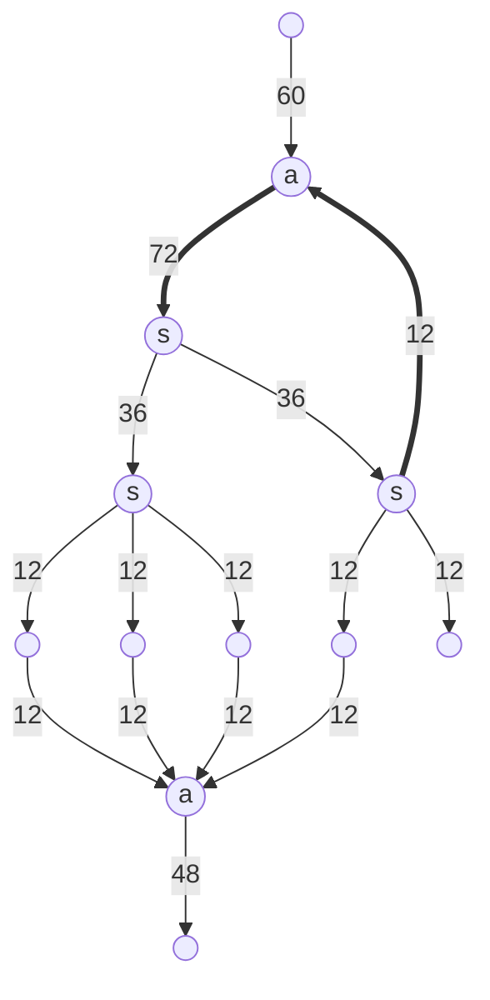
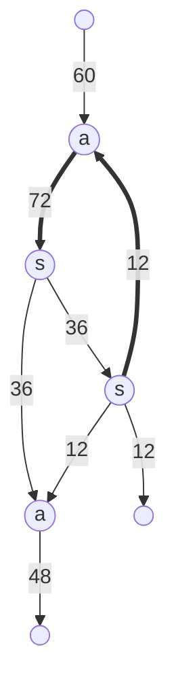

<h1 align="center">Формульный и алгоритмический анализ методов взаимодействия пользователя с конвейерными лентами и маршрутизаторами в компьютерных моделях</h1>

<br>

## Оглавление:
0. Введение
1. Терминология
    1. [Конвейер](#конвейер)
    2. [Конвейерный разъединитель](#Конвейерный-разъединитель)
    3. [Конвейерный соединитель](#Конвейерный-разъединитель)
2. Быстрые системы
    1. [Введение](#введение)
    2. [Теорема о делимости](#теорема-о-делимости)
    3. [Теорема об упрощении]()
3. Вычисление в простых системах
    1. Примеры


<br><br>

<span style="padding-left: 20px">
В данной работе рассматривается типизация, реализация и взаимодействие друг с другом таких объектов, как: конвейерная лента, конвейерный соеденитель, конвейерный разъединитель, и прочие их надстройки
</span>

<span style="padding-left: 20px">

</span>

<br><br>


# Терминология

## Конвейер
<span style="padding-left: 20px">
Конвейер &mdash; средство непрерывной перевозки ресурсов между двумя любыми точками.
</span>
<br><br>

Каждый конвейер характеризуется:
+ Формой 
    + Описывается системой уравнений: &nbsp; $\vec{r}(t) = \begin{cases} x_1 = x_1(t) \\ \vdots \\ x_n = x_n(t) \\ \end{cases} \subset \ \mathbb{R}^n$

    + В частности: $\mathbb{R}^3$ (Satisfactory) или $\mathbb{R}^2$ (Factoro)

+ Функцией распределения динамики скорости вдоль конвейера $v(\vec{r}, t) \cong v(t_{\text{path}}, t_{\text{time}}) = v\left(\vec{t}\right)$

+ Начальной и конечной точкой: $A = \vec{r}(0), \ B = \vec{r}(t\to\text{max})$

<br>

<span style="padding-left: 20px">
На чертежах обозначается кривой, либо отрезком, соединяющим точки A и B. Может иметь стрелки для указания направления движения, а рядом может подписываться пропускная способность
</span>

<br>





<br><br><br>

## Конвейерный соединитель
<span style="padding-left: 20px">
Конвейерный соединитель &mdash; устройство, соединяющее несколько входных лент в одну. Ресурсы выводятся по заданным правилам, и выбор между ресурсами производится по другим правилам
</span>

<br>

Каждый конвейерный соединитель характеризуется:
+ числом входных лент $n$
+ правилами распределения: $\{ \varphi_i(v_{\text{in}}) \ | \ i \in \mathbb{N} , i \le n \}$
+ правилом вывода: $\psi$

<br>

<span style="padding-left: 20px">
На чертежах обозначается n-угольником (обычно, квадрат) с буквой "a" (adder), к которому с одной стороны подводится конвейер на вывод, а с остальных сторон &mdash; конвейеры входят
</span>

<br>


<br><br><br>

## Конвейерный разъединитель
<span style="padding-left: 20px">
Конвейерный разъединитель &mdash; устройство, разъединяющее одну конвейерную ленту на несколько других, пропускающих ресурсы по заданным правилам
</span>

<br>

Каждый конвейерный разъединитель характеризуется:
+ числом выходных лент $n$
+ правилами распределения: $\{ \varphi_i(v_{\text{in}}) \ | \ i \in \mathbb{N} , i \le n \}$

<br>

<span style="padding-left: 20px">
На чертежах обозначается n-угольником (обычно, квадрат) с буквой "s" (splitter), к которому с одной стороны подводится конвейер, а с остальных сторон &mdash; конвейеры отводятся
</span>

<br>


<br><br>


<h1 align="center">Какими бывают системы данных элементов?</h1>
<br><br><br>

# Быстрые системы

## Введение

Рассмотрим следующую систему:
+ Конвейер имеет равномерную скорость $v$ (достаточно большое)
+ Есть несколько видов конвейерных разъединителей.
    + число выходов которых образует множество $\mathbb{T} = \{ t_1, ..., t_n \}$
    + правило вывода: чередовать ресурс между выходами
        + схема очерёдности вывода для делителя на 4:
        ```mermaid
        graph TD;
            1((1))
            2((2))
            3((3))
            4((4))

            1---2;
            2---3;
            1---4;
            4---3;
        ```
        + распределение происходит мгновенно, как только ресурс заходит &mdash; так только и выходит
+ Конвейерный соединитель может принимать любое число ресурсов, и мгновенно объединяет их в один конвейер

Назовём такую систему "быстрой"

<br>

В быстрых системах определён следующий набор действий:
+ Разделение &mdash; разделение одного конвейера на $t$ равных частей,
+ Соединение &mdash; соединение $n \in \mathbb{N}$ конвейеров в один,
+ Отделение &mdash; набор из последовательных и параллельныхсоединений с целью отделения $q_1$ ресурсов от конвейерной ленты, перевозящей $q_0$ ресурсов ($q_1 < q_0$)
+ Возврат &mdash; сначала отделение некоторой части потока, а затем соединение этой части с началом самого потока
    + Пример:
        ```mermaid
        graph LR;
            1((1))
            2((2))
            3((3))
            4((4))
            5((5))
            6((6))

            1-->2
            2-->3
            3-->6
            3-->4
            4-->2
            4-->5
        ```

<br><br>

<span style="padding-left: 20px">Назовём </span>
все числа вида $\prod_{i=1}^n t_i^{a_i}$ , где $a_i \in \mathbb{N}_0$ "стандартными". Тогда каждое число, обратное стандартному может быть полученно, как отделение от конвейера в 1 при помощи смеси $t_1$-арного, ..., и $t_n$-арного деревьев

Пример: для множества $\mathbb{T} = \{2, 3\}$ , число $2^13^1=6$ является стандартным, тогда $1/6$ является стандартной дробью, его можно получить двумя способами:


<br><br>

## Теорема о делимости
<span style="padding-left: 20px">Если </span>
некоторую стандартную долю конвейера $\frac{a}{s}$ (s &mdash; стандартное число, $a < s$) возвратить в его начало &mdash; то на участке до начала отделения пойдёт $q_0 + \frac{a}{s}\cdot q_0$ , после второй рекурсии &mdash; $q_0 + \frac{a}{s}\cdot \left( q_0 + \frac{a}{s}\cdot q_0 \right)$ , и так далее.

Таким образом, в конечном итоге по данному участку будет идти:
$$\sum_{i=0}^{\infty} q_0 \cdot \left( \frac{a}{s} \right)^i = q_0 \cdot \frac{1}{1-\frac{a}{s}} = q_0\cdot\frac{s}{s-a}$$

Так как $a$ можно выбрать произвольное &mdash; то от конвейера можно отделить даже не стандартную долю

Обозначим операцию преобразования дроби $\frac{a}{s}$ в дробь $\frac{a}{b}$ &nbsp; $(b \le s)$ за:
$$\frac{a}{s} - \frac{s-b}{s} := \frac{a}{s} \cdot \frac{1}{1 - \frac{s-b}{s}} = \frac{a}{b}$$

Теорема: любой единичный конвейер можно разделить на любые два положительных рациональных, в сумме дающих единицу, как рациональные доли входного конвейера при помощи операций отделения и возврата

$$\forall \ q_1 , q_2 \in \mathbb{Q} \ (q_1 + q_2 = q_0) \ :$$
$$\exists \ a, b, s \in \mathbb{N} \ (a_0, a_1 \le s) \ (s - \text{standart}) \ |$$
$$q_1 = \frac{a}{s} - \frac{b}{s} \ , \ q_2 = \frac{s-a-b}{s} - \frac{b}{s}$$


<br><br><br>

## Теорема об упрощении
Назовём системы:
+ "простыми": если $\forall \ t_i \in \mathbb{T} \ : \ t_i$ &mdash; простое
+ "полупростыми": если $\forall t_i, t_j \in \mathbb{T} \ : \ \gcd(t_i, t_j) = 1$
+ "дублирующими": если $\exists \ t, a, b \in \mathbb{T} \ , \ \exists \ x, y \in \mathbb{N}_0 \ , \ t = a^x b^y$


Теорема: любую дублирующую систему можно упростить:

$$\forall \ \mathbb{T} \ | \ \exists \ t, a, b \in \mathbb{T} \ , \ \exists x, y \in \mathbb{N}_0 \ , \ t = a^x b^y \ :$$
$$\exists \ \mathbb{T}' = \mathbb{T} \setminus \{t \ : \ \exists \ a, b \in \mathbb{T} \ , \ \exists x, y \in \mathbb{N}_0 \ | \ t = a^x b^y \} \ne \empty$$
$$\mathbb{T}' - \text{prime / half-prime}$$

<br><br><br>


# Вычисление в простых системах
## Примеры

<span style="padding-left: 20px">Рассмотрим </span> 
$\mathbb{T} = \{2, 3\}$

___
### 1
Допустим, от конвейера в 60 требуется отделить 15 и 45

$\frac{15}{60} = \frac{1}{4} = \frac{1}{2}\cdot\frac{1}{2}$

$\frac{45}{60} = \frac{3}{4} = 3 \cdot \frac{1}{2}\cdot\frac{1}{2}$




Заметим, что данную схему можно упростить:



(Можно рисовать более компактно и удобно, ноя использую mermaid для программного описания данных графов. Более сложные чертежи буду всё же отдельно отрисовывать, и вставлять, как картинки)


___
### 2
Допустим, от конвейера в 60 требуется отделить 12 и 48

$\frac{12}{60} = \frac{1}{5} = \frac{1}{6} - \frac{1}{6} = \frac{1}{2}\cdot\frac{1}{3} - \frac{1}{2}\cdot\frac{1}{3}$

$\frac{48}{60} = \frac{4}{5} = \frac{4}{6} - \frac{1}{6} = \frac{2}{3} - \frac{1}{2}\cdot\frac{1}{3}$



можно упростить:

