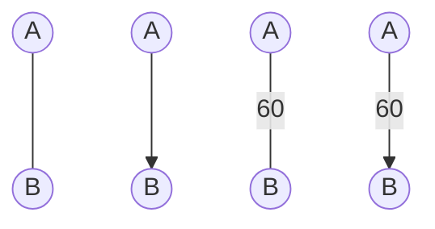
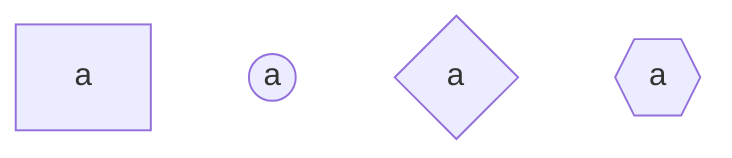
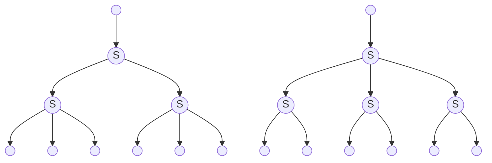
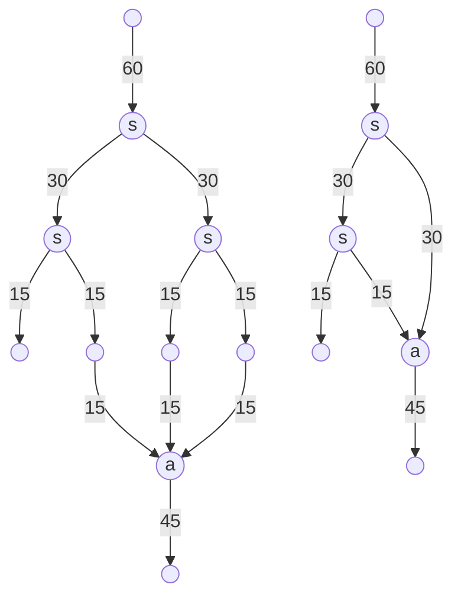
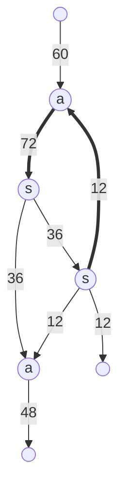
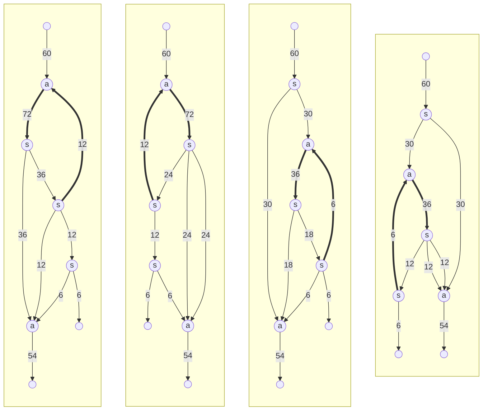
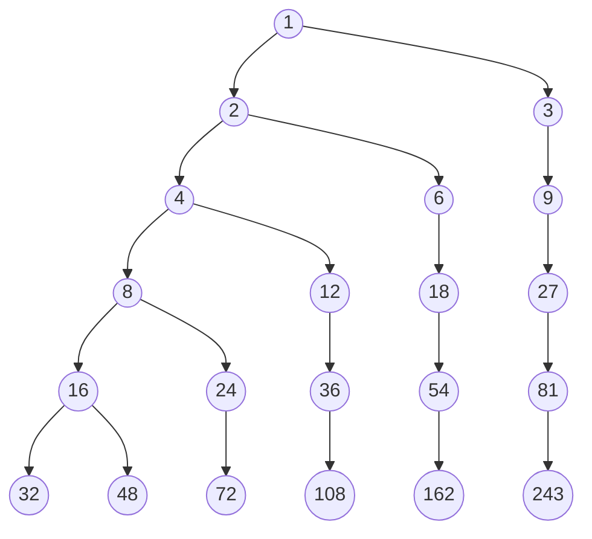

<h1 align="center">Формульный и алгоритмический анализ методов взаимодействия пользователя с конвейерными лентами и маршрутизаторами в компьютерных моделях</h1>

<br>

## Оглавление:
0. Введение
1. Терминология
    1. [Конвейер](#конвейер)
    2. [Конвейерный разъединитель](#Конвейерный-разъединитель)
    3. [Конвейерный соединитель](#Конвейерный-соеденитель)
2. Быстрые системы
    1. [Введение](#введение)
    2. [Теорема о делимости](#теорема-о-делимости)
    3. [Теорема об упрощении]()
3. Вычисление в простых системах
    1. Примеры


<br><br>

<span style="padding-left: 20px">
В данной работе рассматривается типизация, реализация и взаимодействие друг с другом таких объектов, как: конвейерная лента, конвейерный соединитель, конвейерный разъединитель, и прочие их надстройки
</span>


<br><br><br>


# Терминология

## Конвейер
<span style="padding-left: 20px">
Конвейер &mdash; средство непрерывной перевозки ресурсов между двумя любыми точками.
</span>
<br><br>

Каждый конвейер характеризуется:
+ Формой 
    + Описывается системой уравнений: &nbsp; $\vec{r}(t) = \begin{cases} x_1 = x_1(t) \\ \vdots \\ x_n = x_n(t) \\ \end{cases} \subset \ \mathbb{R}^n$

    + В частности: $\mathbb{R}^3$ (Satisfactory) или $\mathbb{R}^2$ (Factoro)

+ Функцией распределения динамики скорости вдоль конвейера $v(\vec{r}, t) \cong v(t_{\text{path}}, t_{\text{time}}) = v\left(\vec{t}\right)$

+ Начальной и конечной точкой: $A = \vec{r}(0), \ B = \vec{r}(t\to\text{max})$

<br>

<span style="padding-left: 20px">
На чертежах обозначается кривой, либо отрезком, соединяющим точки A и B. Может иметь стрелки для указания направления движения, а рядом может подписываться пропускная способность
</span>

<br>





<br><br><br>

## Конвейерный соединитель
<span style="padding-left: 20px">
Конвейерный соединитель &mdash; устройство, соединяющее несколько входных лент в одну. Ресурсы выводятся по заданным правилам, и выбор между ресурсами производится по другим правилам
</span>

<br>

Каждый конвейерный соединитель характеризуется:
+ числом входных лент $n$
+ правилами распределения: $\{ \varphi_i(v_{\text{in}}) \ | \ i \in \mathbb{N} , i \le n \}$
+ правилом вывода: $\psi$

<br>

<span style="padding-left: 20px">
На чертежах обозначается n-угольником (обычно, квадрат) с буквой "a" (adder), к которому с одной стороны подводится конвейер на вывод, а с остальных сторон &mdash; конвейеры входят
</span>

<br>





<br><br><br>

## Конвейерный разъединитель
<span style="padding-left: 20px">
Конвейерный разъединитель &mdash; устройство, разъединяющее одну конвейерную ленту на несколько других, пропускающих ресурсы по заданным правилам
</span>

<br>

Каждый конвейерный разъединитель характеризуется:
+ числом выходных лент $n$
+ правилами распределения: $\{ \varphi_i(v_{\text{in}}) \ | \ i \in \mathbb{N} , i \le n \}$

<br>

<span style="padding-left: 20px">
На чертежах обозначается n-угольником (обычно, квадрат) с буквой "s" (splitter), к которому с одной стороны подводится конвейер, а с остальных сторон &mdash; конвейеры отводятся
</span>

<br>


<br><br>


<h1 align="center">Какими бывают системы данных элементов?</h1>
<br><br><br>

# Быстрые системы

## Введение

Рассмотрим следующую систему:
+ Конвейер имеет равномерную скорость $v$ (достаточно большое)
+ Есть несколько видов конвейерных разъединителей.
    + число выходов которых образует множество $\mathbb{T} = \{ t_1, ..., t_n \}$
    + правило вывода: чередовать ресурс между выходами
        + схема очерёдности вывода для делителя на 4:
        ```mermaid
        graph TD;
            1((1))
            2((2))
            3((3))
            4((4))

            1---2;
            2---3;
            1---4;
            4---3;
        ```
        + распределение происходит мгновенно, как только ресурс заходит &mdash; так только и выходит
+ Конвейерный соединитель может принимать любое число ресурсов, и мгновенно объединяет их в один конвейер

Назовём такую систему "быстрой"

<br>

В быстрых системах определён следующий набор действий:
+ Разделение &mdash; разделение одного конвейера на $t$ равных частей,
+ Соединение &mdash; соединение $n \in \mathbb{N}$ конвейеров в один,
+ Отделение &mdash; набор из последовательных и параллельных соединений с целью отделения $q_1$ ресурсов от конвейерной ленты, перевозящей $q_0$ ресурсов ($q_1 < q_0$)
+ Возврат &mdash; сначала отделение некоторой части потока, а затем соединение этой части с началом самого потока
    + Пример:
        ```mermaid
        graph LR;
            1((1))
            2((2))
            3((3))
            4((4))
            5((5))
            6((6))

            1-->2
            2-->3
            3-->6
            3-->4
            4-->2
            4-->5
        ```

<br><br>

<span style="padding-left: 20px">Назовём </span>
все числа вида $\prod_{i=1}^n t_i^{a_i}$ , где $a_i \in \mathbb{N}_0$ "стандартными". Тогда каждое число, обратное стандартному может быть получено, как отделение от конвейера в 1 при помощи смеси $t_1$-арного, ..., и $t_n$-арного деревьев

Пример: для множества $\mathbb{T} = \{2, 3\}$ , число $2^13^1=6$ является стандартным, тогда $1/6$ является стандартной дробью, его можно получить двумя способами:


<br><br>

## Теорема о делимости
<span style="padding-left: 20px">Если </span>
некоторую стандартную долю конвейера $\frac{a}{s}$ (s &mdash; стандартное число, $a < s$) возвратить в его начало &mdash; то на участке до начала отделения пойдёт $q_0 + \frac{a}{s}\cdot q_0$ , после второй рекурсии &mdash; $q_0 + \frac{a}{s}\cdot \left( q_0 + \frac{a}{s}\cdot q_0 \right)$ , и так далее.

Таким образом, в конечном итоге по данному участку будет идти:
$$\sum_{i=0}^{\infty} q_0 \cdot \left( \frac{a}{s} \right)^i = q_0 \cdot \frac{1}{1-\frac{a}{s}} = q_0\cdot\frac{s}{s-a}$$

Так как $a$ можно выбрать произвольное &mdash; то от конвейера можно отделить даже не стандартную долю

Обозначим операцию преобразования дроби $\frac{a}{s}$ в дробь $\frac{a}{b}$ &nbsp; $(b \le s)$ за:
$$\frac{a}{s} - \frac{s-b}{s} := \frac{a}{s} \cdot \frac{1}{1 - \frac{s-b}{s}} = \frac{a}{b}$$

Теорема: любой единичный конвейер можно разделить на любые два положительных рациональных, в сумме дающих единицу, как рациональные доли входного конвейера при помощи операций отделения и возврата

$$\forall \ q_1 , q_2 \in \mathbb{Q} \ (q_1 + q_2 = q_0) \ :$$
$$\exists \ a, b, s \in \mathbb{N} \ (a, b \le s) \ (s - \text{standart}) \ |$$
$$q_1 = \frac{a}{s} - \frac{b}{s} \ , \ q_2 = \frac{s-a-b}{s} - \frac{b}{s}$$


<br><br><br>

## Теорема об упрощении
Назовём системы:
+ "простыми": если $\forall \ t_i \in \mathbb{T} \ : \ t_i$ &mdash; простое
+ "полупростыми": если $\forall t_i, t_j \in \mathbb{T} \ : \ \gcd(t_i, t_j) = 1$
+ "дублирующими": если $\exists \ t, a, b \in \mathbb{T} \ , \ \exists \ x, y \in \mathbb{N}_0 \ , \ t = a^x b^y$


Теорема: любую дублирующую систему можно упростить:

$$\forall \ \mathbb{T} \ | \ \exists \ t, a, b \in \mathbb{T} \ , \ \exists x, y \in \mathbb{N}_0 \ , \ t = a^x b^y \ :$$
$$\exists \ \mathbb{T}' = \mathbb{T} \setminus \{t \ : \ \exists \ a, b \in \mathbb{T} \ , \ \exists x, y \in \mathbb{N}_0 \ | \ t = a^x b^y \} \ne \empty$$
$$\mathbb{T}' - \text{prime / half-prime}$$

<br><br><br>


# Вычисление в простых системах
## Примеры

<span style="padding-left: 20px">Рассмотрим </span> 
$\mathbb{T} = \{2, 3\}$

___
### 1-упрощение
Допустим, от конвейера в 60 требуется отделить 15 и 45

$\frac{15}{60} = \frac{1}{4} = \frac{1}{2}\cdot\frac{1}{2}$

$\frac{45}{60} = \frac{3}{4} = 3 \cdot \frac{1}{2}\cdot\frac{1}{2}$

нарисуем 2 варианта реализации:



Сначала представлена оригинальная схема, которая первой приходит в голову, а далее представлена её упрощённая версия, т.к. видно, что оба конвейера, идущие из одного сплиттера уходят один аддер &mdash; тогда делитель был лишним

(Можно рисовать более компактно и удобно, но я использую mermaid для программного описания данных графов. Более сложные чертежи буду всё же отдельно отрисовывать, и вставлять, как картинки)

<br><br><br>


___
### 2-рекурсия
Допустим, от конвейера в 60 требуется отделить 12

$\frac{12}{60} = \frac{1}{5} = \frac{1}{6} - \frac{1}{6} = \frac{1}{2}\cdot\frac{1}{3} - \frac{1}{2}\cdot\frac{1}{3}$

$\frac{48}{60} = \frac{4}{5} = \frac{4}{6} - \frac{1}{6} = \frac{2}{3} - \frac{1}{2}\cdot\frac{1}{3}$





<br><br><br>


___
### 3-вариативность
От конвейера в 60 отделить 6. Рассмотрим все (сокращённые) варианты реализации данной схемы:

$\frac{6}{60} = \frac{1}{10} = \frac{1}{12} - \frac{2}{12} = \frac{1}{12} - \frac{1}{6}$



<br><br>

Как видим, количество соединителей и разъединителей &mdash; инвариантно от смены топологии графа

Это всё варианты для $s = 12$, а ведь можно взять не только самый ближний вариант: можно взять ближайшие 2: 16 или 18. Или выбрать только из n-арного дерева: 16 или 27. Так же есть некоторые "интересные" дроби, которые можно разложить нетривиально:

$$\frac{5}{6} = \frac{1}{2} + \frac{1}{3}$$

2 и 3 являются взаимнопростыми, и их можно получить только отрекурсировав остатки от друг друга: отделить 1/3, и от оставшихся 2/3 рекурсией уловить 1/2


<br><br><br>


## Решение

Любую стандартную дробь можно представить, как сумму некоторого количества других стандартных дробей:

$$\forall \ \frac{a}{s} \ : \ \exists \ n \in \mathbb{N}, A = \{a_i\}, S = \{s_i\} \ | \ \frac{a}{s} = \sum_{i=1}^n \frac{a_i}{s_i}$$

"Элементарными" назовём несократимые стандартные дроби, для которых $n=1$

Для дроби $\frac{a}{b}$ "решением" назовём $A_b^a = O_b^a - R_b$ (под "-" подразумеваем его определение через рекурсию), где:
+ $s = S(b)$ &mdash; ближайшее большее стандартное к $b$
+ $O_b^a = O_{s}^a = \sum_{i=1}^n \frac{a_i}{s_i}$
+ $R_b = O_{s}^{s-b}$

Тогда задача сводится к изучению получения оптимальных $S(b)$ и $O_b^a$


<br><br>

Реализация поиска $S(b)$ для $\mathbb{T} = \{2, 3\}$ из программы `satisfactory conveyor calc`

```cs
public static int hig_closest(int number, int x = 0, int y = 0, int branch = 1)
{
    int answer = -1;
    int num = Convert.ToInt32(Math.Pow(2, x) * Math.Pow(3, y));

    // ветвь становится листом в этой точке
    if (num >= number) { answer = num; }
    else
    {
        List<int> answers = new List<int>();

        answers.Add(hig_closest(number, x + 1, y, 0));
        if (branch == 1) 
        { answers.Add(hig_closest(number, x, y + 1, 1)); }
            
        answer = answers.Min();
    }

    return answer;
}
```

Описывает дерево следующего вида:





<br><br><br>

По аналогии можно реализовать для $\mathbb{T}$ бóльших размеров

pseudocod
```py
def hig_closest(target, powers, branch=max(T)):
    answer = -1
    num = 1
    for i from 0 to T.len():
        num *= T[i]^powers[i]
    
    if num >= target: return num

    answers = []
    for i in T:
        if i <= branch>:
            answers.append(hig_closest(target, powers.increace(i), i))
        
    answer = answers.min()

    return answer
```

<br><br><br>

<span style="padding-left: 20px">Вот </span>
нашли мы $s$, и как нам получить $O_s^a$ ? Алгоритм прост: брутфорс. $a$ надо разложить на все возможные суммы натуральных[$^1$](#1) чисел, и понасокращать получившиеся дроби

<br>

реализация упрощённого алгоритма:

```py
def spliter(numerator, denominator):
    """
    на вход принимает 
    числитель и знаменатель дроби.
    выводит список дробей с 
    минимальными знаменателями 
    вида 2^x * 3^y
    """
    # подгон под ближайшее число
    # вида 2^x * 3^y, и сокращает
    d_c = hig_closest(denominator)
    d_g = gcd(d_c, numerator)
    d_d = numerator // d_g
    d_f = d_c // d_g
    
    # находит ближайшее 
    d_p0 = low_closest(d_d, d_f)
    
    # тривиальный случай, когда дробь
    # упрощена донельзя
    if d_p0 == d_d:
        return [[d_d, d_f]]
        
    else:
        # дробит дробь на две поменьше
        g1 = gcd(d_d-d_p0, d_f)
        g2 = gcd(d_p0, d_f)
        # сохраняет обе дроби
        d_parts = [[(d_d-d_p0)//g1, d_f//g1], [d_p0//g2, d_f//g2]]
                      
        # если возможно, продолжает 
        # процесс дробления
        while 1:
            # сюда сохраняются две дроби,
            # на которые раздробятся
            # все сохранённые на данной
            # итерации дроби
            d_parts_ = []
            
            # дробит
            for fractions in d_parts:
                x, y = fractions[0], fractions[1]
                p = low_closest(x, y)
                
                # если есть куда упрощать
                # — сохраняет две 
                # упрощённые дроби
                if p != x:
                    g1 = gcd(x-p, y)
                    g2 = gcd(p, y)
                    d_parts_.append([(x-p)//g1, y//g1])
                    d_parts_.append([p//g2, y//g2])
                    
                # если некуда упрощать 
                # — сохраняет так
                else: d_parts_.append(fractions)
            
            # если нет изменений — кончаем
            if len(d_parts) == len(d_parts_): break
            else: d_parts = d_parts_[0::]
        return d_parts[0::]
```

Оригинальный алгоритм на C# здесь приводить не будем, он громоздок (175 строчек основной функции + 211 вспомогательных + матапарат), но он приведён во вложениях

<br><br>

#### 1
Можно и не натуральные, но это сильно усложнит реализацию.

Пример удачного применения:

$\frac{2}{3} = \frac{1.5}{3} + \frac{0.5}{3} = \frac{1}{2} + \frac{1}{6}$

Для систем с другим базисом такое может быть уместнее


